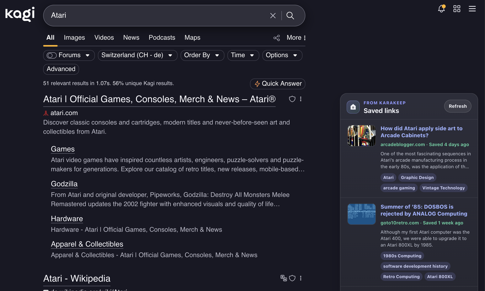

# Kagi × Karakeep

**Version:** [<!-- version -->1.0.0<!-- /version -->](https://github.com/L-K-M/kagi-x-karakeep/releases/latest)

A small Firefox extension that adds a Karakeep results card to Kagi search pages. It reads the Kagi search term from `https://kagi.com/search?q=...`, searches your Karakeep bookmarks, and renders matching saved links in Kagi's right column.



> [!IMPORTANT]
> LLM Disclosure: This project was developed with the assistance of large language models (AI coding tools).

## Configure

1. Open the extension settings page.
2. Set your Karakeep server URL, for example `https://cloud.karakeep.app` or your self-hosted root URL.
3. Paste a Karakeep API token.
4. Choose how many results to show.
5. Use `Test Connection` to verify the token.

If you use an `http://` local address, enable `Allow HTTP server URLs for local/self-hosted testing`. Firefox may prompt for permission to connect to the configured origin.

## Build

The tooling is [`web-ext`](https://extensionworkshop.com/documentation/develop/web-ext-command-reference/), Mozilla's official command-line tool, driven through `npm` scripts. Install it once:

```bash
npm install
```

Then:

```bash
npm run lint     # validate the manifest and sources (web-ext lint)
npm run build    # package an unsigned .zip into web-ext-artifacts/
npm run start    # run the add-on in a temporary Firefox profile (web-ext run)
```

`npm run build` writes a version-stamped archive, e.g. `web-ext-artifacts/kagi_karakeep-0.1.3.zip`, containing only the runtime files (`manifest.json`, `src/`, `icons/`, `README.md`, `LICENSE`).

To produce a signed `.xpi` for permanent installation, generate [Mozilla Add-ons API credentials](https://addons.mozilla.org/developers/addon/api/key/), then:

```bash
export WEB_EXT_API_KEY="your-jwt-issuer"
export WEB_EXT_API_SECRET="your-jwt-secret"
npm run sign
```

The same signing happens automatically in CI when a `v*` tag is pushed and the `AMO_JWT_ISSUER` / `AMO_JWT_SECRET` repository secrets are configured — see [CICD.md](CICD.md).

## Releases

Releases are cut by pushing a version tag. The shared [release tool](https://github.com/L-K-M/release-tool) does it in one step:

```bash
scripts/release.sh 1.2.3 --push     # bump manifest.json, commit, tag v1.2.3, and push
```

Pushing the `v*` tag triggers [`.github/workflows/release.yml`](.github/workflows/release.yml), which verifies the tag matches `manifest.json`, packages the extension with `web-ext` (signing through Mozilla Add-ons when the AMO secrets are set, otherwise an unsigned `.zip`), and publishes a GitHub Release with auto-generated notes. Every pull request and push to `main` is linted by [`.github/workflows/ci.yml`](.github/workflows/ci.yml). The `<!-- version -->` marker near the top of this file is kept in step by the release tool. See [CICD.md](CICD.md) for the full pipeline.

## Temporary Installation

1. Open `about:debugging#/runtime/this-firefox` in Firefox.
2. Choose `Load Temporary Add-on...`.
3. Select `manifest.json` from this repository.
4. Configure the extension settings.
5. Search on Kagi.

## Notes

This intentionally avoids Karakeep-Pipette's broader engine support, UI stack, and extra bookmark actions. The extension is plain JavaScript and only targets Kagi.
